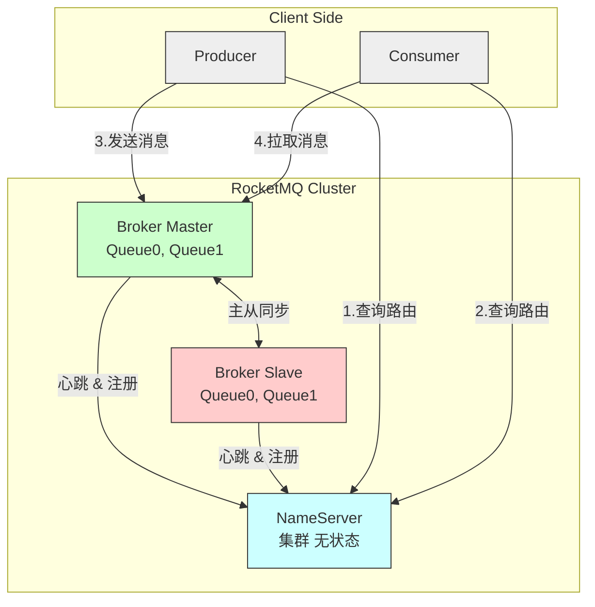
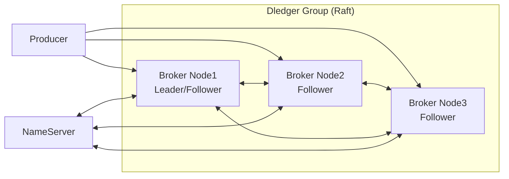

## Apache RocketMQ 简介

**Apache RocketMQ** 是一款由阿里巴巴开源、后捐赠给 Apache 基金会的 **分布式消息中间件**，具有**高吞吐、低延迟、高可用、高可靠、金融级一致性**等特性，广泛应用于电商、金融、物流、物联网等对消息可靠性要求极高的场景。

📚 官网：https://rocketmq.apache.org
📘 GitHub：https://github.com/apache/rocketmq
📘 中文文档：https://rocketmq.apache.org/zh/docs/

------

## 🌟 核心特性

| 特性                | 说明                                                        |
| ------------------- | ----------------------------------------------------------- |
| **高吞吐 & 低延迟** | 单机可支撑 **10万+ TPS**，毫秒级投递延迟                    |
| **金融级可靠性**    | 支持同步刷盘 + 主从同步，确保消息不丢失（如支付宝交易消息） |
| **顺序消息**        | 严格保证 **全局或分区顺序**（如订单状态变更）               |
| **事务消息**        | 支持分布式事务（“半消息”机制），实现最终一致性              |
| **消息轨迹**        | 可追踪消息从生产到消费的全链路                              |
| **定时/延迟消息**   | 支持 **18 个等级**的延迟（1s ~ 2h），也支持自定义定时       |
| **海量消息堆积**    | 支持 **TB 级消息堆积**，不影响性能                          |
| **多语言客户端**    | 官方支持 Java、C++、Go、Python、Node.js 等                  |
| **云原生支持**      | 支持 Kubernetes 部署，兼容阿里云 RocketMQ 商业版            |

------

## 📦 核心架构组件

### 1. **NameServer（注册中心）**

- 轻量级服务发现组件，管理 Broker 的路由信息
- 无状态，支持集群部署（通常 2 节点以上）
- Producer/Consumer 通过 NameServer 获取 Broker 地址

### 2. **Broker（消息服务器）**

- 核心数据节点，负责消息的**存储、投递、查询**
- 分为 **Master** 和 **Slave**（主从架构，支持同步/异步复制）
- 每个 Broker 可包含多个 **Topic 的队列（MessageQueue）**

### 3. **Producer（生产者）**

- 发送消息到 Broker
- 支持 **同步、异步、单向** 三种发送方式
- 自动从 NameServer 获取路由，负载均衡选择队列

### 4. **Consumer（消费者）**

- 从 Broker 拉取消息
- 支持两种消费模式：
  - **集群消费（Clustering）**：同组内负载均衡（默认）
  - **广播消费（Broadcasting）**：每条消息被组内所有消费者消费




1. **启动阶段**：
   - Broker 启动后，向所有 NameServer 注册自己的地址和 Topic 路由信息。
   - NameServer 保存 Broker 列表和 Topic → Queue 的映射。
2. **生产消息**：
   - Producer 启动时从 NameServer 拉取 Topic 的路由信息（包含 Broker 地址、Queue 分布）。
   - Producer 根据负载均衡策略选择一个 MessageQueue，直接连接对应 Broker 发送消息。
3. **消费消息**：
   - Consumer 启动时同样从 NameServer 获取路由信息。
   - Consumer 向 Broker 发起长轮询（Pull 模式），拉取指定 Queue 的消息。
   - 消费成功后，Consumer 提交消费位点（Offset）到 Broker。
4. **高可用保障**：
   - 若 Master Broker 宕机，Slave 可接管读请求（写需切换）。
   - NameServer 集群无状态，任意节点宕机不影响服务。

> 💡 **说明**
>
> - 实际部署中，NameServer 通常为 2~3 节点集群。
> - Broker 可部署多组（Broker Group），每组含 1 Master + N Slave。
> - Producer/Consumer **直连 Broker**，NameServer 仅用于路由发现，**不参与消息传输**，因此性能极高。

## 📌 核心概念

| 概念             | 说明                                                    |
| ---------------- | ------------------------------------------------------- |
| **Topic**        | 消息的逻辑分类（如 `OrderTopic`, `UserEvent`）          |
| **Tag**          | Topic 下的二级分类，用于过滤（如 `TagA`, `TagB`）       |
| **MessageQueue** | Topic 的物理分片，类似 Kafka 的 Partition，实现并行处理 |
| **Group**        | Producer Group / Consumer Group，用于标识应用分组       |
| **Offset**       | 消费者在 MessageQueue 中的消费位置                      |

> ✅ **Topic + Queue 模型**：
>  一个 Topic 被分为多个 MessageQueue，分布在不同 Broker 上，实现水平扩展。

## 📦 数据存储结构（补充）

每个 Broker 上的 Topic 被划分为多个 **MessageQueue**，物理存储如下：

```text
Broker
├── commitlog/                # 所有消息顺序写入此文件（Append-only）
├── consumequeue/             # 每个 Queue 的索引文件（逻辑队列）
│   ├── TopicA/
│   │   ├── 0/               # QueueId=0
│   │   ├── 1/               # QueueId=1
│   └── TopicB/
└── index/                    # 消息索引（用于按 key 查询）
```

> ✅ **设计优势**：
>
> - **CommitLog 顺序写**：极大提升磁盘 I/O 性能
> - **ConsumeQueue 轻量索引**：快速定位消息位置
> - **消息与索引分离**：兼顾写入性能与查询效率

## 🌐 高可用架构（Dledger 模式）



> ✅ **Dledger 优势**：
>
> - **自动选主**（Leader Election）
> - 强一致性复制（Quorum 写入）
> - 故障自动切换，无需人工干预

------

## ✅ 总结：RocketMQ 架构核心思想

| 设计原则       | 体现                                              |
| -------------- | ------------------------------------------------- |
| **去中心化**   | NameServer 仅做路由，不参与消息流转               |
| **高性能写入** | CommitLog 顺序写 + 异步刷盘                       |
| **高可用**     | 主从复制 / Dledger 自动容灾                       |
| **水平扩展**   | 增加 Broker 节点即可扩容 Topic Queue              |
| **解耦**       | Producer/Consumer 通过 NameServer 动态发现 Broker |

------


------

## 🔄 消息类型支持

| 类型         | 说明                           | 典型场景                       |
| ------------ | ------------------------------ | ------------------------------ |
| **普通消息** | 最基础的消息类型               | 日志、通知                     |
| **顺序消息** | 保证同一业务 ID 的消息严格有序 | 订单创建 → 支付 → 发货         |
| **事务消息** | “半消息” + 本地事务状态回查    | 跨系统转账、库存扣减           |
| **延迟消息** | 指定延迟时间后投递             | 订单超时取消、30分钟未支付提醒 |
| **批量消息** | 一次发送多条，提升吞吐         | 日志批量上报                   |

------

## 🛠️ 典型应用场景

| 场景                    | RocketMQ 优势                   |
| ----------------------- | ------------------------------- |
| **电商交易系统**        | 事务消息保障订单与库存一致性    |
| **金融支付**            | 同步刷盘 + 主从架构，消息零丢失 |
| **实时数据同步**        | 高吞吐支撑海量数据管道          |
| **削峰填谷**            | 秒杀请求入队，后端平稳处理      |
| **事件驱动架构（EDA）** | 解耦微服务，通过事件通信        |
| **IoT 设备上报**        | 支持海量设备连接与消息堆积      |

------

## ⚙️ 高级能力

### 1. **消息重试 & 死信队列**

- 消费失败自动重试（最多 16 次）
- 超过重试次数进入 **死信队列（DLQ）**，便于人工干预

### 2. **消息过滤**

- **Tag 过滤**：Consumer 只订阅特定 Tag
- **SQL 表达式过滤**：基于消息属性动态过滤（如 `a > 5 AND b = 'X'`）

### 3. **主从架构 & Dledger**

- 传统主从：异步/同步复制
- **Dledger 模式**（基于 Raft）：自动选主，实现 **自动故障转移**（类似 Kafka KRaft）

### 4. **运维监控**

- 提供 **RocketMQ Console**（开源管理界面）
- 支持 Prometheus + Grafana 监控

## ✅ 总结

> **RocketMQ 是为“高可靠、强一致、复杂业务”而生的消息中间件，尤其适合金融级应用场景。**

它在 **事务消息、顺序消息、延迟消息** 等方面提供了 Kafka 和 RabbitMQ 难以替代的能力，已成为国内互联网大厂（阿里、腾讯、字节等）的主流选择。

## 🥇集成示例

✨代码文件：[middleware-message/rocketmq at master · xiaopengooo0/middleware-message](https://github.com/xiaopengooo0/middleware-message/tree/master/rocketmq)

### 1.依赖引入

```xml
        <dependency>
            <groupId>org.apache.rocketmq</groupId>
            <artifactId>rocketmq-spring-boot-starter</artifactId>
            <version>2.3.1</version>
        </dependency>
```

### 2.配置文件

```yml
rocketmq:
  name-server: 127.0.0.1:9876
  producer:
    group: rocketmq-group
    send-message-timeout: 3000
    retry-times-when-send-failed: 2
```

### 3. 配置注入

```java
// 事务监听器
@RocketMQTransactionListener
public class TransactionListenerImpl implements RocketMQLocalTransactionListener {
    
    @Override
    public RocketMQLocalTransactionState executeLocalTransaction(Message msg, Object arg) {
        try {
            // 执行本地事务
            boolean success = executeBusinessTransaction(msg, arg);
            return success ? RocketMQLocalTransactionState.COMMIT 
                          : RocketMQLocalTransactionState.ROLLBACK;
        } catch (Exception e) {
            return RocketMQLocalTransactionState.UNKNOWN;
        }
    }
    
    @Override
    public RocketMQLocalTransactionState checkLocalTransaction(Message msg) {
        // 检查本地事务状态
        boolean committed = checkTransactionStatus(msg);
        return committed ? RocketMQLocalTransactionState.COMMIT 
                        : RocketMQLocalTransactionState.ROLLBACK;
    }
    
    private boolean executeBusinessTransaction(Message msg, Object arg) {
        // 实现业务事务逻辑
        return true;
    }
    
    private boolean checkTransactionStatus(Message msg) {
        // 实现事务状态检查逻辑
        return true;
    }
}
```

### 4.生产者配置

```java
@Component
public class RocketMQProducer {

    private static final Logger log = LoggerFactory.getLogger(RocketMQProducer.class);
    @Autowired
    private RocketMQTemplate rocketMQTemplate;
    
    private static final String TOPIC = "user-topic";
    private static final String ORDERLY_TOPIC = "order-topic";
    
    // 发送普通消息（带normal标签）
    public void sendMessage(String message) {
        log.info("【RocketMQProducer】发送消息：{}", message);
        rocketMQTemplate.convertAndSend(TOPIC + ":normal", message);
    }
    
    // 发送带tag的消息
    public void sendMessageWithTag(String message) {
        log.info("【RocketMQProducer】发送带tag的消息：{}", message);
        rocketMQTemplate.convertAndSend(TOPIC + ":tagA", message);
    }
    
    // 发送顺序消息
    public void sendOrderlyMessage(String orderId, String message) {
        log.info("【RocketMQProducer】发送顺序消息：{}", message);
        rocketMQTemplate.syncSendOrderly(ORDERLY_TOPIC, message, orderId);
    }
    
    // 发送事务消息
    public void sendTransactionMessage(String message, Object arg) {
        TransactionSendResult result = rocketMQTemplate.sendMessageInTransaction(
            TOPIC, 
            MessageBuilder.withPayload(message).build(),
            arg
        );
        log.info("Transaction send result: {}", result.getSendStatus());
    }
}
```

### 5.消费者配置

```java
@Component
public class RocketMQConsumer {

    private static final Logger log = LoggerFactory.getLogger(RocketMQConsumer.class);
    @Service
    // 普通消费 - 只接收normal标签的消息
    @RocketMQMessageListener(
        topic = "user-topic",
        consumerGroup = "common-consumer-group",
        selectorExpression = "normal"
    )
    public static class CommonConsumer implements RocketMQListener<String> {
        @Override
        public void onMessage(String message) {
            log.info("Received normal message: " + message);
        }
    }
    @Service
    // 带tag过滤的消费 - 只接收tagA标签的消息
    @RocketMQMessageListener(
        topic = "user-topic",
        selectorExpression = "tagA",
        consumerGroup = "tag-consumer-group"
    )
    public static class TagConsumer implements RocketMQListener<String> {
        @Override
        public void onMessage(String message) {
            log.info("Received tagged message: " + message);
        }
    }
    @Service
    // 顺序消费
    @RocketMQMessageListener(
        topic = "order-topic",
        consumerGroup = "orderly-consumer-group",
        consumeMode = ConsumeMode.ORDERLY
    )
    public static class OrderlyConsumer implements RocketMQListener<String> {
        @Override
        public void onMessage(String message) {
            log.info("Received orderly message: " + message);
        }
    }
```

### 6. 测试消息

```java
@SpringBootTest
@RunWith(SpringRunner.class)
public class ApiTest {

    @Resource
    private RabbitMQProducer rabbitMQProducer;

    @Test
    public void sendMessage() throws InterruptedException {
        rabbitMQProducer.sendDirectMessage("hello rabbitmq");
        rabbitMQProducer.sendTopicMessage("topic.message", "hello top rabbitmq");
        rabbitMQProducer.sendTopicMessage("topic.message.top", "hello top rabbitmq");
        rabbitMQProducer.sendMessageWithConfirm("hello rabbitmq");
        
        // 增加等待时间确保消费者处理完消息
        Thread.sleep(10000);
    }
}
```

### 输出示例

```powershell
2025-10-31 14:15:03.174  INFO 31272 --- [           main] c.s.m.r.producer.RocketMQProducer        : 【RocketMQProducer】发送消息：hello rocketmq
2025-10-31 14:15:03.213  INFO 31272 --- [           main] c.s.m.r.producer.RocketMQProducer        : 【RocketMQProducer】发送带tag的消息：hello rocketmq with tag 
2025-10-31 14:15:03.217  INFO 31272 --- [onsumer-group_1] c.s.m.r.consumer.RocketMQConsumer        : Received normal message: hello rocketmq
2025-10-31 14:15:03.217  INFO 31272 --- [           main] c.s.m.r.producer.RocketMQProducer        : 【RocketMQProducer】发送顺序消息：hello rocketmq with orderly
2025-10-31 14:15:03.224  INFO 31272 --- [           main] c.s.m.r.producer.RocketMQProducer        : 【RocketMQProducer】发送事务消息：hello rocketmq with transaction
2025-10-31 14:15:03.227  INFO 31272 --- [onsumer-group_1] c.s.m.r.consumer.RocketMQConsumer        : Received orderly message: hello rocketmq with orderly
2025-10-31 14:15:03.229  INFO 31272 --- [           main] c.s.m.r.config.TransactionListenerImpl   : 【TransactionListenerImpl】接受到事务消息： ----rocketmq with transaction---
2025-10-31 14:15:03.229  INFO 31272 --- [           main] c.s.m.r.config.TransactionListenerImpl   : 【TransactionListenerImpl】执行本地事务： ----rocketmq with transaction---
2025-10-31 14:15:03.407  INFO 31272 --- [onsumer-group_1] c.s.m.r.consumer.RocketMQConsumer        : Received tagged message: hello rocketmq with tag 
```

### docker 配置

`docker-compose.yml`

```yml
version: '3.8'


services:
  # NameServer：RocketMQ 的注册中心
  namesrv:
    image: apache/rocketmq:5.3.3
    container_name: rocketmq-namesrv
    ports:
      - "9876:9876"
    command: sh mqnamesrv
    networks:
      - rocketmq-net

  # Broker：消息服务器（主节点）
  broker:
    image: apache/rocketmq:5.3.3
    container_name: rocketmq-broker
    ports:
      - "10911:10911"   # broker 主端口
    environment:
      - JAVA_OPT_EXT=-server -Xms1g -Xmx1g -Xmn512m
    volumes:
      - ./broker.conf:/home/rocketmq/rocketmq-5.1.0/conf/broker.conf
    depends_on:
      - namesrv
    command: >
      sh mqbroker
      -n namesrv:9876
      -c /home/rocketmq/rocketmq-5.1.0/conf/broker.conf
    networks:
      - rocketmq-net

networks:
  rocketmq-net:
    driver: bridge


```

镜像地址：`swr.cn-north-4.myhuaweicloud.com/ddn-k8s/docker.io/apache/rocketmq:5.3.3-linuxarm64`

`broker.conf`

```properties
# broker 名称
brokerName = broker-a
brokerId = 0

# NameServer 地址（容器内通过服务名访问）
namesrvAddr = namesrv:9876

# 监听地址（必须设为 0.0.0.0，否则 Docker 外部无法访问）
brokerIP1 = 0.0.0.0

# Broker 对外服务端口
listenPort = 10911

# 自动创建 Topic（开发环境建议开启）
autoCreateTopicEnable = true

# VIP 通道（通常关闭以避免端口冲突）
enableVipChannel = false
```


## 🌟 RocketMQ 事务消息的核心优势

### ✅ 1. **原生支持“最终一致性”分布式事务**

RocketMQ 提供了一套 **可靠、简洁、高性能** 的事务消息模型，无需依赖外部协调器（如 Seata、TCC 框架），即可实现跨服务的事务一致性。

> **典型场景**：
>  用户下单 → 扣减库存 → 创建订单
>  要求：**要么全部成功，要么全部失败**

------

### ✅ 2. **基于“半消息 + 事务状态回查”机制**

RocketMQ 的事务消息采用 **两阶段提交（2PC）思想**，但做了优化，避免长时间锁资源：

 🔄 事务消息流程：

1. **第一阶段：发送“半消息”（Half Message）**
   - Producer 向 Broker 发送一条 **不可见** 的消息（消费者看不到）
   - Broker 持久化该消息，但不投递给 Consumer
2. **执行本地事务**
   - Producer 执行本地业务逻辑（如：扣减数据库库存）
   - 根据执行结果，返回：
     - `COMMIT`：提交消息，消费者可见
     - `ROLLBACK`：丢弃消息
     - `UNKNOWN`：状态未知（如超时、异常）
3. **第二阶段：Broker 主动回查（Transaction Check）**
   - 如果 Producer 返回 `UNKNOWN` 或无响应，Broker 会**定时回调 Producer 的 `checkLocalTransaction` 方法**
   - Producer 根据本地事务状态，再次返回 `COMMIT` 或 `ROLLBACK`
   - 最终确保消息状态与本地事务一致


```java
// 示例：事务消息发送
TransactionMQProducer producer = new TransactionMQProducer("my-group");
producer.setTransactionListener(new TransactionListener() {
    @Override
    public LocalTransactionState executeLocalTransaction(Message msg, Object arg) {
        try {
            // 1. 执行本地事务（如：更新DB）
            boolean success = doBusinessLogic();
            return success ? LocalTransactionState.COMMIT_MESSAGE 
                           : LocalTransactionState.ROLLBACK_MESSAGE;
        } catch (Exception e) {
            return LocalTransactionState.UNKNOW;
        }
    }

    @Override
    public LocalTransactionState checkLocalTransaction(MessageExt msg) {
        // 2. 回查本地事务状态（如：查DB是否已提交）
        boolean committed = queryTransactionStatusFromDB(msg);
        return committed ? LocalTransactionState.COMMIT_MESSAGE 
                         : LocalTransactionState.ROLLBACK_MESSAGE;
    }
});
```

------

### ✅ 3. **高可靠性保障**

| 机制             | 说明                                                         |
| ---------------- | ------------------------------------------------------------ |
| **半消息持久化** | 即使 Producer 崩溃，Broker 仍保留半消息，等待回查            |
| **自动重试回查** | Broker 默认每 1 分钟回查一次，最多 15 次（可配置）           |
| **消息不丢失**   | 结合同步刷盘 + 主从复制，确保事务消息 100% 可靠              |
| **幂等消费**     | 消费者需自行实现幂等，但 RocketMQ 提供消息 ID（`msgId`）便于去重 |

------

### ✅ 4. **性能与解耦兼顾**

- **异步提交**：本地事务执行完即可返回，无需等待消费者处理
- **无中心协调器**：避免 Seata/TCC 的全局锁和性能瓶颈
- **低侵入**：业务代码只需实现两个回调方法，无需改造数据库

> 💡 相比传统 2PC（如 XA），RocketMQ 事务消息：
>
> - 不锁定数据库资源
> - 不依赖数据库事务日志
> - 更适合高并发场景

## 🏦 典型金融场景示例

**场景：用户转账**

1. A 账户扣款（本地事务）
2. 发送事务消息到 MQ
3. B 账户加款（消费者处理）

✅ **一致性保证**：

- 若 A 扣款失败 → 消息回滚，B 不加款
- 若 A 扣款成功但消息发送失败 → Broker 回查发现 A 已扣款 → 补发消息 → B 加款
- 若 B 消费失败 → 消息重试，直到成功（配合死信队列兜底）

------

## ⚠️ 注意事项

1. **消费者必须幂等**：因为消息可能重复投递
2. **回查接口要轻量**：避免阻塞 Broker 线程
3. **合理设置回查次数和间隔**：避免无限重试
4. **监控事务状态**：及时发现长时间 `UNKNOWN` 的消息

------

## ✅ 总结：RocketMQ 在事务处理上的核心优势

> **“用消息中间件的能力，优雅解决分布式事务难题”**

| 优势                  | 价值                               |
| --------------------- | ---------------------------------- |
| **原生事务消息支持**  | 开箱即用，无需引入额外框架         |
| **半消息 + 回查机制** | 保证本地事务与消息发送的最终一致性 |
| **高可靠、高可用**    | 金融级 SLA，消息零丢失             |
| **高性能、低延迟**    | 适合高并发交易场景                 |
| **架构简洁、易维护**  | 降低系统复杂度和运维成本           |

因此，在需要 **强一致性、高可靠、事务保障** 的业务中（如支付、订单、账务），**RocketMQ 是目前最成熟、最实用的消息中间件选择之一**。