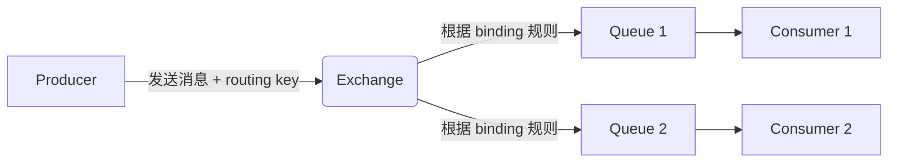

## RabbitMQ 简介

RabbitMQ 是一个开源的 **消息代理（Message Broker）** 和 **队列服务器**，基于 **AMQP（Advanced Message Queuing Protocol）** 协议实现，用于在分布式系统中实现**应用解耦、异步通信、流量削峰、可靠传递**等核心能力。

📚 官网：https://www.rabbitmq.com
📘 文档：https://www.rabbitmq.com/documentation.html

------

## 🌟 核心特性

| 特性                               | 说明                                                         |
| ---------------------------------- | ------------------------------------------------------------ |
| **可靠性（Reliability）**          | 支持消息持久化、发布确认（Publisher Confirms）、手动 ACK，确保消息不丢失 |
| **灵活的路由（Flexible Routing）** | 通过 Exchange + Binding + Routing Key 实现复杂路由逻辑       |
| **集群与高可用**                   | 支持多节点集群、镜像队列（Mirrored Queues），保障服务高可用  |
| **多协议支持**                     | 原生支持 AMQP 0.9.1，也支持 MQTT、STOMP、HTTP 等插件         |
| **管理界面**                       | 提供 Web UI（15672 端口），可视化监控队列、连接、消息等      |
| **多语言客户端**                   | 官方支持 Java、Python、.NET、Go、JavaScript 等主流语言       |
| **插件生态**                       | 丰富的插件系统（如延迟队列、消息追踪、认证等）               |

------

## 📦 核心概念（AMQP 模型）

### 1. **Producer（生产者）**

- 发送消息的应用程序
- 不直接发送到队列，而是发送到 **Exchange**

### 2. **Consumer（消费者）**

- 接收并处理消息的应用程序
- 从 **Queue** 中拉取消息

### 3. **Queue（队列）**

- 存储消息的缓冲区
- FIFO（先进先出），消息在被消费前一直保留（可配置 TTL）

### 4. **Exchange（交换机）**

- 消息的“路由器”，决定消息如何分发到队列
- 类型决定路由行为：

| Exchange 类型 | 路由规则                                 |
| ------------- | ---------------------------------------- |
| **Direct**    | 精确匹配 `routing key`                   |
| **Fanout**    | 广播到所有绑定的队列（忽略 routing key） |
| **Topic**     | 模糊匹配（支持 `*` 和 `#` 通配符）       |
| **Headers**   | 基于消息头（headers）匹配（较少用）      |

### 5. **Binding（绑定）**

- 建立 Exchange 与 Queue 之间的关联规则
- 可包含 `routing key` 或 `headers`

### 6. **Routing Key（路由键）**

- 生产者发送消息时指定的字符串
- Exchange 根据它决定消息去向

------

## 🔄 消息流转流程



✅ **关键点**：生产者 **不知道队列的存在**，只与 Exchange 交互。

## 🛠️ 典型应用场景

| 场景           | 说明                                         |
| -------------- | -------------------------------------------- |
| **异步处理**   | 用户注册后异步发邮件、短信                   |
| **应用解耦**   | 订单服务与库存服务通过消息通信，避免直接调用 |
| **流量削峰**   | 秒杀系统将请求暂存队列，后端平稳消费         |
| **日志处理**   | 收集日志到队列，由专门服务分析               |
| **最终一致性** | 分布式事务中通过消息实现状态同步             |
| **广播通知**   | 使用 Fanout Exchange 向多个服务广播事件      |

------

## ⚙️ 高级功能

### 1. **消息确认机制**

- **生产者确认（Publisher Confirms）**：Broker 收到消息后回调通知生产者
- **消费者 ACK**：手动确认（`ack`）或自动确认（`autoAck`），避免消息丢失

### 2. **持久化**

- Exchange、Queue、Message 均可设为 **durable**，Broker 重启后不丢失

### 3. **死信队列（DLX）**

- 消息被拒绝、TTL 过期或队列满时，自动转入 **Dead Letter Exchange**
- 用于异常处理、延迟重试等

### 4. **延迟队列**

- 通过插件 `rabbitmq-delayed-message-exchange` 实现
- 或用 TTL + DLX 模拟

### 5. **镜像队列（Mirrored Queues）**

- 队列内容在集群多个节点复制，实现高可用


## ✅ 总结

> **RabbitMQ 是一个成熟、稳定、功能丰富的消息中间件，特别适合需要可靠传递、灵活路由和复杂业务集成的场景。**

它以 **AMQP 协议为核心**，通过 **Exchange/Queue/Binding** 模型提供了极强的灵活性，配合持久化、ACK、死信队列等机制，成为企业级应用的首选消息解决方案。

## 🥇集成示例

✨代码文件：[middleware-message/rabbitmq at master · xiaopengooo0/middleware-message](https://github.com/xiaopengooo0/middleware-message/tree/master/rabbitmq)

### 1.依赖引入

```xml
        <dependency>
            <groupId>org.springframework.boot</groupId>
            <artifactId>spring-boot-starter-amqp</artifactId>
        </dependency>
```

### 2.配置文件

```yml
spring:
  rabbitmq:
    host: localhost
    port: 5672
    username: rabbit
    password: message
    virtual-host: /
    # 生产者配置
    publisher-confirm-type: correlated
    publisher-returns: true
    # 消费者配置
    listener:
      simple:
        acknowledge-mode: manual
        prefetch: 10
    # 添加连接相关配置
    connection-timeout: 60000
```

### 3. 配置注入

```java
@Configuration
public class RabbitMQConfig {


    // 直连交换机
    public static final String DIRECT_EXCHANGE = "direct.exchange";
    public static final String DIRECT_QUEUE = "direct.queue";
    public static final String DIRECT_ROUTING_KEY = "direct.routing.key";

    // 主题交换机
    public static final String TOPIC_EXCHANGE = "topic.exchange";
    public static final String TOPIC_QUEUE = "topic.queue";
    // 修改绑定键以匹配测试中的路由键
    public static final String TOPIC_BINDING_KEY = "topic.message.*";
    private static final Logger log = LoggerFactory.getLogger(RabbitMQConfig.class);


    /**
     * 创建一个持久化的直连交换机，参数为：交换机名称、持久化(true)、不自动删除(false)
     * @return
     */
    @Bean
    public DirectExchange directExchange() {
        return new DirectExchange(DIRECT_EXCHANGE, true, false);
    }

    /**
     * 创建一个持久化的队列，参数为：队列名称、持久化(true)、排他(false)、自动删除(false)
     * @return
     */
    @Bean
    public Queue directQueue() {
        return new Queue(DIRECT_QUEUE, true, false, false);
    }


    /**
     * 创建一个直连绑定关系
     * @return
     */
    @Bean
    public Binding directBinding() {
        return BindingBuilder.bind(directQueue())
                .to(directExchange())
                .with(DIRECT_ROUTING_KEY);
    }

    /**
     * 创建一个主题交换机，参数为：交换机名称、持久化(true)、不自动删除(false)
     * @return
     */
    @Bean
    public TopicExchange topicExchange() {
        return new TopicExchange(TOPIC_EXCHANGE, true, false);
    }

    /**
     * 创建一个持久化的队列，参数为：队列名称、持久化(true)、排他(false)、自动删除(false)
     * @return
     */
    @Bean
    public Queue topicQueue() {
        return new Queue(TOPIC_QUEUE, true, false, false);
    }

    /**
     * 创建一个主题绑定关系
     * @return
     */
    @Bean
    public Binding topicBinding() {
        return BindingBuilder.bind(topicQueue())
                .to(topicExchange())
                // 使用能匹配测试中路由键的绑定键
                .with(TOPIC_BINDING_KEY);
    }


    @Bean
    public Queue dlxQueue() {
        return QueueBuilder
                .durable("dlx.queue") // 必须和已有队列一致
                .build();
    }


    /**
     * 创建一个消息确认回调，参数为：确认回调、失败回调
     * @return
     */
    @Bean
    public RabbitTemplate.ConfirmCallback confirmCallback() {
        // 消息确认回调 correlationData 消息唯一标识符 ,ack 是否成功 ,cause 失败原因

        return (correlationData, ack, cause) -> {
            if (ack) {
                log.info("Message confirmed, correlationData: {}", correlationData);
            } else {
                log.error("Message failed, cause: {}", cause);
            }
        };
    }
    

    
    /**
     * 配置RabbitTemplate
     * @param connectionFactory
     * @return
     */
    @Bean
    public RabbitTemplate rabbitTemplate(ConnectionFactory connectionFactory) {
        RabbitTemplate template = new RabbitTemplate(connectionFactory);
        template.setConfirmCallback(confirmCallback());
        template.setReturnsCallback(returned -> {
            log.error("Message returned: exchange={}, routingKey={}, replyCode={}, replyText={}",
                    returned.getExchange(), returned.getRoutingKey(),
                    returned.getReplyCode(), returned.getReplyText());
        });
        // 启用消息返回功能
        template.setMandatory(true);
        return template;
    }
}
```

### 4.生产者配置

```java
@Component
public class RabbitMQProducer {

    private static final Logger log = LoggerFactory.getLogger(RabbitMQProducer.class);
    
    @Autowired
    private RabbitTemplate rabbitTemplate;

    
    // 发送到直连交换机
    public void sendDirectMessage(String message) {
        log.info("发送到直连交换机：{}", message);
        rabbitTemplate.convertAndSend(
            RabbitMQConfig.DIRECT_EXCHANGE,
            RabbitMQConfig.DIRECT_ROUTING_KEY,
            message,
            // 设置消息持久化
            msg -> {
                msg.getMessageProperties().setDeliveryMode(MessageDeliveryMode.PERSISTENT);
                return msg;
            },
                new CorrelationData(UUID.randomUUID().toString())
        );
    }
    
    // 发送到主题交换机
    public void sendTopicMessage(String routingKey, String message) {
        log.info("发送到主题交换机：{} - {}", routingKey, message);
        rabbitTemplate.convertAndSend(
            RabbitMQConfig.TOPIC_EXCHANGE,
            routingKey,
            message, new CorrelationData(UUID.randomUUID().toString())
        );
    }
    
    // 发送带确认的消息
    public void sendMessageWithConfirm(String message) {
        log.info("发送带确认消息：{}", message);
        CorrelationData correlationData = new CorrelationData(UUID.randomUUID().toString());
        
        rabbitTemplate.convertAndSend(
            RabbitMQConfig.DIRECT_EXCHANGE,
            RabbitMQConfig.DIRECT_ROUTING_KEY,
            message,
            correlationData
        );
    }
}
```

### 5.消费者配置

```java
@Component
public class RabbitMQConsumer {

    private static final Logger log = LoggerFactory.getLogger(RabbitMQConsumer.class);

    // 直连队列消费者

    /**
     *  监听直连队列
     * @param message 消息
     * @param channel   频道
     * @param deliveryTag 消息的标识
     */
    @RabbitListener(queues = RabbitMQConfig.DIRECT_QUEUE)
    public void processDirectMessage(String message, Channel channel,
                                   @Header(AmqpHeaders.DELIVERY_TAG) long deliveryTag) {
        try {
            log.info("Received direct message: {}", message);
            // 业务处理
            processBusiness(message);
            // 手动确认
            channel.basicAck(deliveryTag, false);
        } catch (Exception e) {
            log.error("处理直连消息失败: ", e);
            try {
                // 拒绝消息，重新入队
                channel.basicNack(deliveryTag, false, true);
            } catch (IOException ex) {
                log.error("拒绝消息失败: ", ex);
            }
        }
    }
    
    // 主题队列消费者

    /**
     *  监听主题队列
     * @param message   消息
     * @param amqpMessage  AMQP消息
     */
    @RabbitListener(queues = RabbitMQConfig.TOPIC_QUEUE)
    public void processTopicMessage(String message, Message amqpMessage) {
        String routingKey = amqpMessage.getMessageProperties().getReceivedRoutingKey();
        log.info("Received topic message with routing key {}: {}", routingKey, message);
        processBusiness(message);
    }
    
    // 死信队列处理
    @RabbitListener(queues = "dlx.queue")
    public void processDeadLetterMessage(String message) {
        log.info("---------Received dead letter message: {}", message);
        // 处理死信消息
    }
    
    private void processBusiness(String message) {
        // 具体的业务处理逻辑
        log.info("---------Processing message: {}", message);
    }
}
```

### 6. 测试消息

```java
@SpringBootTest
@RunWith(SpringRunner.class)
public class ApiTest {

    @Resource
    private RabbitMQProducer rabbitMQProducer;

    @Test
    public void sendMessage() throws InterruptedException {
        rabbitMQProducer.sendDirectMessage("hello rabbitmq");
        rabbitMQProducer.sendTopicMessage("topic.message", "hello top rabbitmq");
        rabbitMQProducer.sendTopicMessage("topic.message.top", "hello top rabbitmq");
        rabbitMQProducer.sendMessageWithConfirm("hello rabbitmq");
        
        // 增加等待时间确保消费者处理完消息
        Thread.sleep(10000);
    }
}
```

### 输出示例

```powershell
2025-10-31 11:00:25.634  INFO 33212 --- [           main] c.s.m.r.producer.RabbitMQProducer        : 发送到直连交换机：hello rabbitmq
2025-10-31 11:00:25.643  INFO 33212 --- [           main] c.s.m.r.producer.RabbitMQProducer        : 发送到主题交换机：topic.message - hello top rabbitmq
2025-10-31 11:00:25.647  INFO 33212 --- [           main] c.s.m.r.producer.RabbitMQProducer        : 发送到主题交换机：topic.message.top - hello top rabbitmq
2025-10-31 11:00:25.647  INFO 33212 --- [ntContainer#0-1] c.s.m.r.consumer.RabbitMQConsumer        : Received direct message: hello rabbitmq
2025-10-31 11:00:25.647  INFO 33212 --- [ntContainer#0-1] c.s.m.r.consumer.RabbitMQConsumer        : ---------Processing message: hello rabbitmq
2025-10-31 11:00:25.648  INFO 33212 --- [ntContainer#2-1] c.s.m.r.consumer.RabbitMQConsumer        : Received topic message with routing key topic.message: hello top rabbitmq
2025-10-31 11:00:25.649  INFO 33212 --- [ntContainer#2-1] c.s.m.r.consumer.RabbitMQConsumer        : ---------Processing message: hello top rabbitmq
2025-10-31 11:00:25.650  INFO 33212 --- [nectionFactory1] c.s.m.rabbitmq.config.RabbitMQConfig     : Message confirmed, correlationData: CorrelationData [id=945ea7ff-83ed-4fb7-9276-a233692632c2]
2025-10-31 11:00:25.651  INFO 33212 --- [           main] c.s.m.r.producer.RabbitMQProducer        : 发送带确认消息：hello confirm rabbitmq
2025-10-31 11:00:25.652  INFO 33212 --- [nectionFactory1] c.s.m.rabbitmq.config.RabbitMQConfig     : Message confirmed, correlationData: CorrelationData [id=8b115f4c-1d75-4904-bc11-a1cd9ebc5394]
2025-10-31 11:00:25.653  INFO 33212 --- [ntContainer#2-1] c.s.m.r.consumer.RabbitMQConsumer        : Received topic message with routing key topic.message.top: hello top rabbitmq
2025-10-31 11:00:25.653  INFO 33212 --- [ntContainer#0-1] c.s.m.r.consumer.RabbitMQConsumer        : Received direct message: hello confirm rabbitmq
2025-10-31 11:00:25.653  INFO 33212 --- [ntContainer#0-1] c.s.m.r.consumer.RabbitMQConsumer        : ---------Processing message: hello confirm rabbitmq
2025-10-31 11:00:25.653  INFO 33212 --- [ntContainer#2-1] c.s.m.r.consumer.RabbitMQConsumer        : ---------Processing message: hello top rabbitmq
2025-10-31 11:00:25.656  INFO 33212 --- [nectionFactory1] c.s.m.rabbitmq.config.RabbitMQConfig     : Message confirmed, correlationData: CorrelationData [id=81dc7ad8-4ab6-400d-bff1-c2590c5ff2cc]
2025-10-31 11:00:25.656  INFO 33212 --- [nectionFactory2] c.s.m.rabbitmq.config.RabbitMQConfig     : Message confirmed, correlationData: CorrelationData [id=5ddf2519-5e73-481a-ba1b-6ae8cd0479ef]

```

### docker 配置

`docker-compose.yml`

```yml
services:
  # RabbitMQ
  rabbitmq:
    image: rabbitmq:3-management
    environment:
      - RABBITMQ_DEFAULT_USER=rabbit
      - RABBITMQ_DEFAULT_PASS=message
    ports:
      - "5672:5672"
      - "15672:15672"

```

镜像地址：`swr.cn-north-4.myhuaweicloud.com/ddn-k8s/docker.io/rabbitmq:3-management-linuxarm64`

