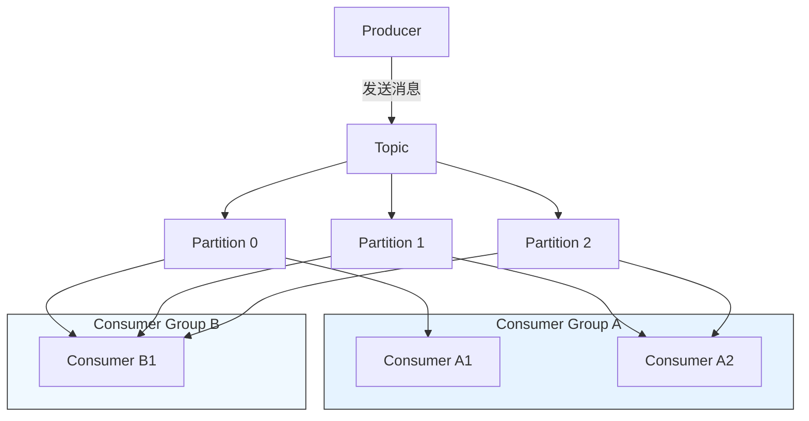

## Kafka 简介

Apache Kafka 是一个**分布式、高吞吐、可扩展、持久化**的流数据平台，最初由 LinkedIn 开发，于 2011 年开源，现由 Apache 软件基金会维护。它被广泛用于构建实时数据管道和流式应用。

📚 官网：https://kafka.apache.org
📘 文档：https://kafka.apache.org/documentation/

------

## 🌟 核心特性

| 特性                 | 说明                                                   |
| -------------------- | ------------------------------------------------------ |
| **高吞吐量**         | 单机每秒可处理数十万条消息，支持 TB 级/天的数据        |
| **低延迟**           | 毫秒级消息传递延迟                                     |
| **持久化存储**       | 消息写入磁盘并支持多副本，保证数据不丢失               |
| **水平扩展**         | 支持集群部署，轻松扩展吞吐能力                         |
| **容错性强**         | 副本机制保障节点故障时服务不中断                       |
| **顺序保证**         | 在分区内（Partition）严格保证消息顺序                  |
| **支持多种消费模式** | 支持实时流处理（Stream Processing）和传统队列/发布订阅 |

------

## 📦 核心概念

### 1. **Topic（主题）**

- 消息的逻辑分类，类似数据库中的“表”
- 生产者将消息发布到 Topic，消费者从 Topic 订阅消息
- 例如：`user-activity`, `order-events`

### 2. **Partition（分区）**

- 每个 Topic 可划分为多个 Partition，实现**并行处理**和**水平扩展**
- 每个 Partition 是一个有序、不可变的消息序列
- 消息在 Partition 内按追加顺序写入，并分配唯一偏移量（Offset）

### 3. **Producer（生产者）**

- 向 Kafka Topic 发送消息的客户端
- 可指定分区策略（如轮询、Key Hash 等）

### 4. **Consumer（消费者）**

- 从 Kafka Topic 读取消息的客户端
- 以 **Consumer Group（消费者组）** 形式组织：
  - 同一组内：每个 Partition 只能被一个 Consumer 消费（负载均衡）
  - 不同组间：广播模式，各自独立消费全量数据

### 5. **Broker（代理）**

- Kafka 集群中的单个服务器节点
- 负责存储数据、处理读写请求

### 6. **ZooKeeper / KRaft（元数据管理）**

- **旧版本（<3.3）**：依赖 ZooKeeper 管理集群元数据、Leader 选举等
- **新版本（≥3.3）**：支持 **KRaft 模式（Kafka Raft Metadata mode）**，**无需 ZooKeeper**，实现自管理

------

## 🔄 工作流程示例



- 生产者发送消息到 `orders` Topic
- Topic 分为 3 个 Partition
- Consumer Group A 中有 2 个消费者：C1 消费 P0+P1，C2 消费 P2
- Consumer Group B 独立消费全部 Partition（广播）

------

## 🛠️ 典型应用场景

| 场景         | 说明                                          |
| ------------ | --------------------------------------------- |
| **日志聚合** | 收集分布式系统日志，统一处理分析              |
| **消息队列** | 替代 RabbitMQ/ActiveMQ，解耦系统              |
| **流式处理** | 与 Kafka Streams、Flink、Spark Streaming 集成 |
| **事件溯源** | 记录业务事件，支持状态重建                    |
| **指标监控** | 实时采集和分析系统指标                        |
| **数据集成** | 使用 Kafka Connect 同步数据库、数据湖等       |

## ✅ 总结

> **Kafka 不只是一个消息队列，而是一个分布式的实时数据流平台。**

它通过**分区、副本、持久化、消费者组**等机制，在**高吞吐、容错、可扩展**之间取得极佳平衡，已成为现代数据架构的核心组件。

适用于：

- 需要处理海量实时数据的场景
- 要求消息可重放、审计、回溯的系统
- 构建事件驱动微服务架构（Event-Driven Architecture）


## 🥇集成示例

✨代码文件 [middleware-message/kafka at master · xiaopengooo0/middleware-message](https://github.com/xiaopengooo0/middleware-message/tree/master/kafka)

### 1.依赖引入

```xml
<dependency>
    <groupId>org.springframework.kafka</groupId>
    <artifactId>spring-kafka</artifactId>
</dependency>
```

### 2.配置文件

```yml
spring:
  kafka:
    listener:
      # RECORD: 每处理一条记录后立即提交偏移量
      # BATCH: 处理完上一批次的所有记录后提交偏移量
      # TIME: 达到设定的ackTime时间后提交偏移量
      # COUNT: 处理记录数量达到ackCount后提交偏移量
      # COUNT_TIME: 数量或时间任一条件满足时提交偏移量
      # MANUAL: 需要手动确认，所有记录处理完成后提交偏移量
      # MANUAL_IMMEDIATE: 手动确认，如果在消费者线程中确认则立即提交
      ack-mode: manual
#      type: batch # 批量处理，默认是单条
    bootstrap-servers: localhost:9092 # kafka server
    producer: #  序列化
      key-serializer: org.apache.kafka.common.serialization.StringSerializer
      value-serializer: org.apache.kafka.common.serialization.StringSerializer
      acks: all # 确保消息被写入
    consumer:
      group-id: kafka-consumer-group
      key-deserializer: org.apache.kafka.common.serialization.StringDeserializer
      value-deserializer: org.apache.kafka.common.serialization.StringDeserializer
      auto-offset-reset: earliest  # 自动偏移量
      enable-auto-commit: false  # 自动提交
      # 设置批量处理相关配置
      #max-poll-records: 3  # 每次拉取最多10条记录
```

> [!NOTE]
>
> `listener.type = batch ` 和 `max-poll-records = 3` 是批量处理，默认是单条处理。对应下方消费者`consumeBatch`可以批量处理消息。

### 3. 配置注入

```java
@Configuration
@EnableKafka
public class KafkaConfig {

    @Value("${spring.kafka.bootstrap-servers}")
    private String bootstrapServers;


    @Bean
    public ProducerFactory<String, String> producerFactory() {
        HashMap<String, Object> prop = new HashMap<>();
        prop.put(ProducerConfig.BOOTSTRAP_SERVERS_CONFIG, bootstrapServers);
        prop.put(ProducerConfig.KEY_SERIALIZER_CLASS_CONFIG, StringSerializer.class);
        prop.put(ProducerConfig.VALUE_SERIALIZER_CLASS_CONFIG, StringSerializer.class);
        return new DefaultKafkaProducerFactory<>(prop);
    }

    @Bean
    public KafkaTemplate<String, String> kafkaTemplate() {
        return new KafkaTemplate<>(producerFactory());
    }


}
```

### 4.生产者配置

```java
@Component
public class KafkaProducer {


    private static final Logger log = LoggerFactory.getLogger(KafkaProducer.class);
    @Autowired
    private KafkaTemplate<String, String> kafkaTemplate;


    private static final String TOPIC = "kafka";


    public void sendMessage(String key, String message) {
        log.info("【KafkaProducer】发送消息：{}", message);
        // 发送消息
        ListenableFuture<SendResult<String, String>> future = kafkaTemplate.send(TOPIC, key, message);
        future.addCallback(new ListenableFutureCallback<SendResult<String, String>>() {
            @Override
            public void onFailure(Throwable ex) {
                log.error("【KafkaProducer】发送消息失败：{}", ex.getMessage());
            }

            @Override
            public void onSuccess(SendResult<String, String> result) {
                log.info("【KafkaProducer】发送消息成功：{}", result.toString());
            }
        });
    }

    /**
     * 发送多条消息
     * @param key
     * @param message
     */
    @Transactional
    public void sendMessageTransaction(String key, String message) {
        log.info("【KafkaProducer】发送事务消息：{}", message);
        kafkaTemplate.executeInTransaction(operations -> {
            operations.send(TOPIC, key, message);
            return true;
        });
    }
}
```

### 5.消费者配置

```java
@Component
public class KafkaConsumer {

    private static final Logger log = LoggerFactory.getLogger(KafkaConsumer.class);

    /**
     * 使用@Header注解从Kafka消息头中提取特定信
     * @param message
     * @param ack
     * @param key
     */
    // 单条消息消费
    @KafkaListener(topics = "kafka", groupId = "kafka-consumer-group")
    public void consumer(String message,
                         Acknowledgment ack,
                         @Header(KafkaHeaders.RECEIVED_MESSAGE_KEY) String key
    ) {
        try {
            log.info("Received message - Key: {}, Value: {}", key, message);

            //处理业务逻辑
            log.info("【KafkaConsumer】处理业务逻辑....");
            // 确认消费
            ack.acknowledge();
        } catch (Exception e) {
            log.error("【KafkaConsumer】处理业务逻辑失败：{}", e.getMessage());
        }
    }


    // 批量消费 - 启用这个监听器来测试批量处理
    @KafkaListener(topics = "kafka", groupId = "kafka-consumer-batch-group")
    public void consumeBatch(List<String> messages, Acknowledgment ack) {
        log.info("=== 批量消费开始 ===");
        log.info("Received batch of {} messages", messages.size());
        for (String message : messages) {
            log.info("Batch processing message: {}", message);
        }
        log.info("=== 批量消费结束 ===");
        ack.acknowledge();
    }
}
```

### 6. 测试消息

```java
@SpringBootTest
@RunWith(SpringRunner.class)
public class ApiTest {


    @Resource
    private KafkaProducer kafkaProducer;


    @Test
    public void sendMessage() throws InterruptedException {
        // 快速连续发送多条消息
        for (int i = 1; i <= 5; i++) {
            kafkaProducer.sendMessage(String.valueOf(i), "hello kafka " + i);
        }
        // 等待一段时间确保消费者处理完消息
        Thread.sleep(1000);
    }
}
```

### 输出示例

#### 默认处理（单条）


```powershell
2025-10-31 10:31:19.750  INFO 39504 --- [ntainer#0-0-C-1] o.s.k.l.KafkaMessageListenerContainer    : kafka-consumer-group: partitions assigned: [kafka-0]
2025-10-31 10:31:19.768  INFO 39504 --- [ntainer#0-0-C-1] c.s.m.kafka.consumer.KafkaConsumer       : Received message - Key: 1, Value: hello kafka 1
2025-10-31 10:31:19.768  INFO 39504 --- [ntainer#0-0-C-1] c.s.m.kafka.consumer.KafkaConsumer       : 【KafkaConsumer】处理业务逻辑....
2025-10-31 10:31:19.774  INFO 39504 --- [ntainer#0-0-C-1] c.s.m.kafka.consumer.KafkaConsumer       : Received message - Key: 2, Value: hello kafka 2
2025-10-31 10:31:19.774  INFO 39504 --- [ntainer#0-0-C-1] c.s.m.kafka.consumer.KafkaConsumer       : 【KafkaConsumer】处理业务逻辑....
2025-10-31 10:31:19.776  INFO 39504 --- [ntainer#0-0-C-1] c.s.m.kafka.consumer.KafkaConsumer       : Received message - Key: 3, Value: hello kafka 3
2025-10-31 10:31:19.776  INFO 39504 --- [ntainer#0-0-C-1] c.s.m.kafka.consumer.KafkaConsumer       : 【KafkaConsumer】处理业务逻辑....
2025-10-31 10:31:19.778  INFO 39504 --- [ntainer#0-0-C-1] c.s.m.kafka.consumer.KafkaConsumer       : Received message - Key: 4, Value: hello kafka 4
2025-10-31 10:31:19.779  INFO 39504 --- [ntainer#0-0-C-1] c.s.m.kafka.consumer.KafkaConsumer       : 【KafkaConsumer】处理业务逻辑....
2025-10-31 10:31:19.782  INFO 39504 --- [ntainer#0-0-C-1] c.s.m.kafka.consumer.KafkaConsumer       : Received message - Key: 5, Value: hello kafka 5
2025-10-31 10:31:19.782  INFO 39504 --- [ntainer#0-0-C-1] c.s.m.kafka.consumer.KafkaConsumer       : 【KafkaConsumer】处理业务逻辑....
```

#### 批量处理

> [!NOTE]
>
> 修改配置 `ack-mode: manual`,`type:batch`,`max-poll-records: 3`

```powershell
2025-10-31 10:42:54.253  INFO 21752 --- [ntainer#0-0-C-1] o.s.k.l.KafkaMessageListenerContainer    : kafka-consumer-batch-group: partitions assigned: [kafka-0]
2025-10-31 10:42:54.272  INFO 21752 --- [ntainer#0-0-C-1] c.s.m.kafka.consumer.KafkaConsumer       : === 批量消费开始 ===
2025-10-31 10:42:54.272  INFO 21752 --- [ntainer#0-0-C-1] c.s.m.kafka.consumer.KafkaConsumer       : Received batch of 3 messages
2025-10-31 10:42:54.272  INFO 21752 --- [ntainer#0-0-C-1] c.s.m.kafka.consumer.KafkaConsumer       : Batch processing message: hello kafka 1
2025-10-31 10:42:54.272  INFO 21752 --- [ntainer#0-0-C-1] c.s.m.kafka.consumer.KafkaConsumer       : Batch processing message: hello kafka 2
2025-10-31 10:42:54.272  INFO 21752 --- [ntainer#0-0-C-1] c.s.m.kafka.consumer.KafkaConsumer       : Batch processing message: hello kafka 3
2025-10-31 10:42:54.272  INFO 21752 --- [ntainer#0-0-C-1] c.s.m.kafka.consumer.KafkaConsumer       : === 批量消费结束 ===
2025-10-31 10:42:54.279  INFO 21752 --- [ntainer#0-0-C-1] c.s.m.kafka.consumer.KafkaConsumer       : === 批量消费开始 ===
2025-10-31 10:42:54.279  INFO 21752 --- [ntainer#0-0-C-1] c.s.m.kafka.consumer.KafkaConsumer       : Received batch of 2 messages
2025-10-31 10:42:54.279  INFO 21752 --- [ntainer#0-0-C-1] c.s.m.kafka.consumer.KafkaConsumer       : Batch processing message: hello kafka 4
2025-10-31 10:42:54.279  INFO 21752 --- [ntainer#0-0-C-1] c.s.m.kafka.consumer.KafkaConsumer       : Batch processing message: hello kafka 5
2025-10-31 10:42:54.279  INFO 21752 --- [ntainer#0-0-C-1] c.s.m.kafka.consumer.KafkaConsumer       : === 批量消费结束 ===
```

### docker 配置

`docker-compose.yml`

```yml
services:
  # RabbitMQ
  kafka:
    image: apache/kafka:3.9.0
    ports:
      - "9092:9092"
```

镜像地址：`swr.cn-north-4.myhuaweicloud.com/ddn-k8s/docker.io/apache/kafka:3.9.0`

