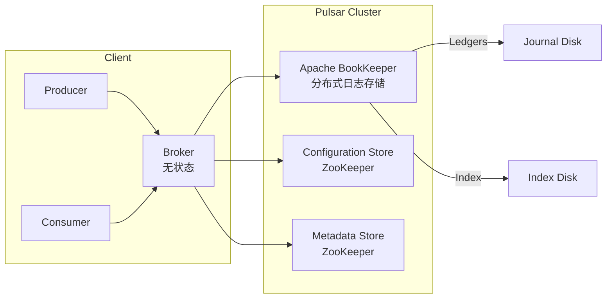

## Apache Pulsar 简介

**Apache Pulsar** 是一个云原生、分布式、高性能的**发布-订阅消息系统**，最初由 Yahoo 开发，于 2016 年开源，2018 年成为 Apache 顶级项目。Pulsar 被设计用于**大规模、多租户、高可靠、低延迟**的场景，是 Kafka 的有力竞争者，尤其在**云原生架构**和**统一消息/流处理平台**方面具有显著优势。

📚 官网：https://pulsar.apache.org
📘 GitHub：https://github.com/apache/pulsar
📘 文档：https://pulsar.apache.org/docs

------

## 🌟 核心特性

| 特性                            | 说明                                                      |
| ------------------------------- | --------------------------------------------------------- |
| **云原生架构**                  | 基于分层存储（Tiered Storage），天然支持 Kubernetes 部署  |
| **计算与存储分离**              | Broker（无状态） + BookKeeper（有状态），独立扩缩容       |
| **多租户支持**                  | 原生支持 Namespace/Topic 级别的配额、隔离和权限控制       |
| **高吞吐 & 低延迟**             | 支持百万级 TPS，端到端延迟可低至毫秒级                    |
| **持久化 & 强一致性**           | 基于 Apache BookKeeper，提供 Quorum 写入和强一致性保证    |
| **统一消息模型**                | 同时支持 **队列（Queue）** 和 **流（Stream）** 消费模式   |
| **地理复制（Geo-Replication）** | 跨数据中心/云区域自动异步复制消息                         |
| **Schema Registry**             | 内置 Schema 管理，支持 Avro、JSON、Protobuf 等            |
| **Functions / IO**              | 内置轻量级流处理（Pulsar Functions）和连接器（Pulsar IO） |

------

## 📦 核心架构：计算与存储分离

这是 Pulsar **最核心的创新**，区别于 Kafka/RocketMQ 的“计算存储一体”架构。

### 架构组件



### 各组件职责

| 组件           | 说明                                                         |
| -------------- | ------------------------------------------------------------ |
| **Broker**     | 无状态服务节点，负责处理 Producer/Consumer 请求、协议转换、负载均衡。**可水平扩展**，重启无数据丢失风险。 |
| **BookKeeper** | 分布式 WAL（Write-Ahead Log）系统，负责**持久化存储消息**。数据分片为 **Ledger**，多副本写入（通常 3 副本），强一致性。 |
| **ZooKeeper**  | 存储集群元数据（Metadata Store）和配置（Configuration Store），**不参与消息读写路径**。 |

> ✅ **优势**：
>
> - **Broker 无状态**：扩缩容秒级完成，不影响服务
> - **存储独立扩展**：消息堆积不影响 Broker 性能
> - **故障隔离**：Broker 宕机不影响数据，BookKeeper 节点故障自动恢复

## 📌 核心概念

| 概念                      | 说明                                                         |
| ------------------------- | ------------------------------------------------------------ |
| **Tenant（租户）**        | 最高层级隔离单位，适合多团队/多客户（如：`finance`, `marketing`） |
| **Namespace（命名空间）** | 租户下的逻辑分组，用于配置策略（如 TTL、Retention、Replication） |
| **Topic（主题）**         | 消息通道，格式：`persistent://tenant/namespace/topic`        |
| **Partitioned Topic**     | 支持分区，每个 Partition 是一个独立的 Topic                  |
| **Subscription（订阅）**  | 消费者组的抽象，支持多种消费模式                             |
| **Cursor（游标）**        | 记录每个 Subscription 的消费位点（由 Broker 管理）           |

------

## 🔄 消费模式（Subscription Types）

Pulsar 支持 **四种订阅类型**，灵活应对不同场景：

| 类型           | 行为                                                | 类似              |
| -------------- | --------------------------------------------------- | ----------------- |
| **Exclusive**  | 仅允许一个 Consumer 消费                            | RabbitMQ 独占队列 |
| **Failover**   | 多个 Consumer，但只有主 Consumer 消费（主挂后切换） | 主备模式          |
| **Shared**     | 多个 Consumer 负载均衡消费（无序）                  | Kafka 消费者组    |
| **Key_Shared** | 按 Key 保证顺序的负载均衡（类似 Kafka 分区内有序）  | Kafka 分区 + Key  |

> ✅ **Key_Shared 是 Pulsar 独有优势**：在 Shared 模式下仍能保证 **相同 Key 的消息顺序**，无需预分配分区。

------

## 🛠️ 高级能力

### 1. **分层存储（Tiered Storage）**

- 热数据存 BookKeeper（高性能）
- 冷数据自动转存到 **S3 / GCS / HDFS**（低成本）
- 消费者可透明访问历史任意消息（无限回溯）

### 2. **消息保留与 TTL**

- **Retention**：保留已消费消息（用于重放）
- **TTL**：未消费消息的存活时间
- 策略可按 Namespace 配置

### 3. **事务消息（2.7+）**

- 支持跨 Topic 的原子写入
- 适用于 Exactly-Once 流处理

### 4. **Pulsar Functions**

- 轻量级 FaaS，类似 AWS Lambda
- 支持 Java/Python/Go，实现消息转换、过滤、聚合

### 5. **Pulsar IO（Connectors）**

- 内置 100+ 连接器（Kafka、MySQL、Elasticsearch、S3 等）
- 替代 Kafka Connect

------

## 🌐 地理复制（Geo-Replication）

- 跨集群自动异步复制消息
- 支持 **Active-Active** 多活架构
- 适用于灾备、全球部署


## ✅ 总结

> **Apache Pulsar 是面向云原生时代的下一代消息平台，通过“计算与存储分离”架构，解决了 Kafka 在多租户、弹性伸缩、长期存储等方面的痛点。**

它不仅是一个消息队列，更是一个 **统一的消息、事件流、流处理平台**，特别适合：

- 大型企业构建**统一消息基础设施**
- **多云/混合云**部署场景
- 需要**无限消息回溯**和**强一致性**的业务

虽然运维复杂度略高，但其架构先进性使其成为未来消息中间件的重要方向。

## 🥇集成示例

✨代码文件：[middleware-message/pulsar at master · xiaopengooo0/middleware-message](https://github.com/xiaopengooo0/middleware-message/tree/master/pulsar)

### 1.依赖引入

```xml
        <dependency>
            <groupId>org.apache.pulsar</groupId>
            <artifactId>pulsar-client</artifactId>
            <version>4.0.7</version> <!-- 建议与服务端版本一致 -->
        </dependency>
```

### 2.配置文件

```yml
pulsar:
  service-url: pulsar://localhost:6650

```

> [!NOTE]
>
> `listener.type = batch ` 和 `max-poll-records = 3` 是批量处理，默认是单条处理。对应下方消费者`consumeBatch`可以批量处理消息。

### 3. 配置注入

```java
@Configuration
public class PulsarConfig {

    @Value("${pulsar.service-url:pulsar://localhost:6650}")
    private String serviceUrl;

    @Bean
    public PulsarClient pulsarClient() throws PulsarClientException {
        return PulsarClient.builder()
                .serviceUrl(serviceUrl)
                .build();
    }
}
```

### 4.生产者配置

```java
@Component
public class PulsarProducer {
    
    @Autowired
    private PulsarClient pulsarClient;
    
    private Producer<String> producer;

    private static final String TOPIC = "persistent://public/default/user-topic";

    @PostConstruct
    public void init() throws PulsarClientException {
        producer = pulsarClient.newProducer(Schema.STRING)
                .topic(TOPIC)
                .compressionType(CompressionType.LZ4)
                .sendTimeout(10, TimeUnit.SECONDS)
                .create();
    }

    @PreDestroy
    public void cleanup() throws PulsarClientException {
        if (producer != null) {
            producer.close();
        }
    }

    // 发送同步消息
    public void sendSyncMessage(String message) throws PulsarClientException {
        MessageId messageId = producer.send(message);
        System.out.println("Sent message with ID: " + messageId);
    }

    // 发送异步消息
    public void sendAsyncMessage(String message) {
        producer.sendAsync(message)
                .thenAccept(messageId -> {
                    System.out.println("Sent message successfully with ID: " + messageId);
                })
                .exceptionally(throwable -> {
                    System.err.println("Failed to send message: " + throwable.getMessage());
                    return null;
                });
    }

    // 发送带属性的消息
    public void sendMessageWithProperties(String message, Map<String, String> properties)
            throws PulsarClientException {
        TypedMessageBuilder<String> messageBuilder = producer.newMessage()
                .value(message);

        properties.forEach(messageBuilder::property);

        messageBuilder.send();
    }

    // 发送延迟消息
    public void sendDelayedMessage(String message, long delay, TimeUnit unit)
            throws PulsarClientException {
        producer.newMessage()
                .value(message)
                .deliverAfter(delay, unit)
                .send();
    }
```

### 5.消费者配置

```java
@Component
public class PulsarConsumer {

    private static final Logger log = LoggerFactory.getLogger(PulsarConsumer.class);
    @Autowired
    private PulsarClient pulsarClient;
    
    private Consumer<String> consumer;
    
    private static final String TOPIC = "persistent://public/default/user-topic";
    private static final String SUBSCRIPTION = "my-subscription";

    /**
     * 初始化消费者
     */
    @PostConstruct
    public void init() throws PulsarClientException {
        consumer = pulsarClient
                .newConsumer(Schema.STRING) // 消息格式
                .topic(TOPIC) // 主题
                .subscriptionName(SUBSCRIPTION) // 订阅名称
                .subscriptionType(SubscriptionType.Shared) // Shared, Failover, Exclusive, Key_Shared
                .subscriptionInitialPosition(SubscriptionInitialPosition.Earliest) // 订阅初始位置
                .negativeAckRedeliveryDelay(10, TimeUnit.SECONDS) // 否定确认延迟
                .subscribe();
        
        startConsuming(); // 启动消费
    }
    
    @PreDestroy
    public void cleanup() throws PulsarClientException {
        if (consumer != null) {
            consumer.close();
        }
    }
    
    private void startConsuming() {
        Executors.newSingleThreadExecutor().submit(() -> {
            while (true) {
                try {
                    // 接收消息（阻塞）
                    Message<String> message = consumer.receive();
                    
                    try {
                        log.info("Received message: " + message.getValue()+ (message.getProperty("key")==null?"":" key:"+message.getProperty("key")));
                        // 处理业务
                        processMessage(message.getValue());
                        // 确认消息
                        consumer.acknowledge(message);
                    } catch (Exception e) {
                        log.error("Failed to process message, negative ack: " + e.getMessage());
                        // 否定确认，消息会重新投递
                        consumer.negativeAcknowledge(message);
                    }
                    
                } catch (PulsarClientException e) {
                    log.error("Error receiving message: " + e.getMessage());
                }
            }
        });
    }
    
    // 批量监听方式
    public void startBatchConsuming() throws PulsarClientException {
        try (Consumer<String> batchConsumer = pulsarClient.newConsumer(Schema.STRING)
                .topic(TOPIC)
                .subscriptionName("batch-subscription")
                .batchReceivePolicy(BatchReceivePolicy.builder()
                        .maxNumMessages(100)
                        .maxNumBytes(10 * 1024 * 1024)
                        .timeout(1, TimeUnit.SECONDS)
                        .build())
                .subscribe()) {

            Executors.newSingleThreadExecutor().submit(() -> {
                while (true) {
                    try {
                        // 批量接收
                        Messages<String> messages = batchConsumer.batchReceive();

                        for (Message<String> message : messages) {
                            try {
                                processMessage(message.getValue());
                                batchConsumer.acknowledge(message);
                            } catch (Exception e) {
                                batchConsumer.negativeAcknowledge(message);
                            }
                        }

                    } catch (PulsarClientException e) {
                        log.error("Error in batch consumption: " + e.getMessage());
                    }
                }
            });
        }
    }
    
    private void processMessage(String message) {
        // 具体的业务处理逻辑
        log.info("Processing: " + message);
    }
}
```

### 6. 测试消息

```java
@SpringBootTest
@RunWith(SpringRunner.class)
public class ApiTest {

    @Resource
    private PulsarProducer pulsarProducer;

    @Resource
    private PulsarMultiTenantProducer pulsarMultiTenantProducer;


    @Test
    public void sendMessage() throws PulsarClientException, InterruptedException {
        pulsarProducer.sendSyncMessage("Hello, Pulsar! ---Sync---");
        pulsarProducer.sendAsyncMessage("Hello, Pulsar! ---Async---");
        pulsarProducer.sendMessageWithProperties("Hello, Pulsar! --Property-- ", Map.of("key", "value"));
        pulsarProducer.sendDelayedMessage("Hello, Pulsar! ---Delayed---", 5, TimeUnit.SECONDS);

        Thread.sleep(5000);


        pulsarMultiTenantProducer.sendToTenant("public", "default", "user-topic", "Hello, Pulsar! ---MultiTenant---");
    }
}
```

### 输出示例

```powershell
Sent message with ID: 3:12:-1
2025-10-31 16:07:17.331  INFO 27240 --- [pool-1-thread-1] c.s.m.pulsar.consumer.PulsarConsumer     : Received message: Hello, Pulsar! ---Sync---
2025-10-31 16:07:17.331  INFO 27240 --- [pool-1-thread-1] c.s.m.pulsar.consumer.PulsarConsumer     : Processing: Hello, Pulsar! ---Sync---
Sent message successfully with ID: 3:13:-1:0
2025-10-31 16:07:17.336  INFO 27240 --- [pool-1-thread-1] c.s.m.pulsar.consumer.PulsarConsumer     : Received message: Hello, Pulsar! ---Async---
2025-10-31 16:07:17.336  INFO 27240 --- [pool-1-thread-1] c.s.m.pulsar.consumer.PulsarConsumer     : Processing: Hello, Pulsar! ---Async---
2025-10-31 16:07:17.336  INFO 27240 --- [pool-1-thread-1] c.s.m.pulsar.consumer.PulsarConsumer     : Received message: Hello, Pulsar! --Property--  key:value
2025-10-31 16:07:17.336  INFO 27240 --- [pool-1-thread-1] c.s.m.pulsar.consumer.PulsarConsumer     : Processing: Hello, Pulsar! --Property-- 
2025-10-31 16:07:22.493  INFO 27240 --- [pool-1-thread-1] c.s.m.pulsar.consumer.PulsarConsumer     : Received message: Hello, Pulsar! ---Delayed---
2025-10-31 16:07:22.493  INFO 27240 --- [pool-1-thread-1] c.s.m.pulsar.consumer.PulsarConsumer     : Processing: Hello, Pulsar! ---Delayed---
2025-10-31 16:07:27.341  INFO 27240 --- [r-client-io-1-3] o.a.p.c.impl.ProducerStatsRecorderImpl   : Starting Pulsar producer perf with config: {"topicName":"persistent://public/default/user-topic","producerName":null,"sendTimeoutMs":30000,"blockIfQueueFull":false,"maxPendingMessages":0,"maxPendingMessagesAcrossPartitions":0,"messageRoutingMode":"RoundRobinPartition","hashingScheme":"JavaStringHash","cryptoFailureAction":"FAIL","batchingMaxPublishDelayMicros":1000,"batchingPartitionSwitchFrequencyByPublishDelay":10,"batchingMaxMessages":1000,"batchingMaxBytes":131072,"batchingEnabled":true,"chunkingEnabled":false,"chunkMaxMessageSize":-1,"encryptionKeys":[],"compressionType":"NONE","initialSequenceId":null,"autoUpdatePartitions":true,"autoUpdatePartitionsIntervalSeconds":60,"multiSchema":true,"accessMode":"Shared","lazyStartPartitionedProducers":false,"properties":{},"initialSubscriptionName":null,"replProducer":false,"nonPartitionedTopicExpected":false}
2025-10-31 16:07:27.341  INFO 27240 --- [r-client-io-1-3] o.a.p.c.impl.ProducerStatsRecorderImpl   : Pulsar client config: {"serviceUrl":"pulsar://localhost:6650","authPluginClassName":null,"authParams":null,"authParamMap":null,"originalPrincipal":null,"operationTimeoutMs":30000,"lookupTimeoutMs":30000,"statsIntervalSeconds":60,"numIoThreads":12,"numListenerThreads":12,"connectionsPerBroker":1,"connectionMaxIdleSeconds":60,"useTcpNoDelay":true,"useTls":false,"tlsKeyFilePath":null,"tlsCertificateFilePath":null,"tlsTrustCertsFilePath":null,"tlsAllowInsecureConnection":false,"tlsHostnameVerificationEnable":false,"sslFactoryPlugin":"org.apache.pulsar.common.util.DefaultPulsarSslFactory","sslFactoryPluginParams":"","concurrentLookupRequest":5000,"maxLookupRequest":50000,"maxLookupRedirects":20,"maxNumberOfRejectedRequestPerConnection":50,"keepAliveIntervalSeconds":30,"connectionTimeoutMs":10000,"requestTimeoutMs":60000,"readTimeoutMs":60000,"autoCertRefreshSeconds":300,"initialBackoffIntervalNanos":100000000,"maxBackoffIntervalNanos":60000000000,"enableBusyWait":false,"listenerName":null,"useKeyStoreTls":false,"sslProvider":null,"tlsKeyStoreType":"JKS","tlsKeyStorePath":null,"tlsKeyStorePassword":null,"tlsTrustStoreType":"JKS","tlsTrustStorePath":null,"tlsTrustStorePassword":null,"tlsCiphers":[],"tlsProtocols":[],"memoryLimitBytes":67108864,"proxyServiceUrl":null,"proxyProtocol":null,"enableTransaction":false,"dnsLookupBindAddress":null,"dnsLookupBindPort":0,"dnsServerAddresses":[],"socks5ProxyAddress":null,"socks5ProxyUsername":null,"socks5ProxyPassword":null,"description":null,"lookupProperties":{},"openTelemetry":null}
2025-10-31 16:07:27.344  INFO 27240 --- [r-client-io-1-3] o.a.pulsar.client.impl.ProducerImpl      : [persistent://public/default/user-topic] [null] Creating producer on cnx [id: 0xbb4bd545, L:/127.0.0.1:64993 - R:localhost/127.0.0.1:6650]
2025-10-31 16:07:27.348  INFO 27240 --- [r-client-io-1-3] o.a.pulsar.client.impl.ProducerImpl      : [persistent://public/default/user-topic] [standalone-0-5] Created producer on cnx [id: 0xbb4bd545, L:/127.0.0.1:64993 - R:localhost/127.0.0.1:6650]
2025-10-31 16:07:27.354  INFO 27240 --- [           main] o.a.p.c.impl.ProducerStatsRecorderImpl   : [persistent://public/default/user-topic] [standalone-0-5] --- Publish throughput: 89.91 msg/s --- 0.02 Mbit/s --- Latency: med: 3.000 ms - 95pct: 3.000 ms - 99pct: 3.000 ms - 99.9pct: 3.000 ms - max: 3.000 ms --- BatchSize: med: 1.000 - 95pct: 1.000 - 99pct: 1.000 - 99.9pct: 1.000 - max: 1.000 --- MsgSize: med: 32.000 bytes - 95pct: 32.000 bytes - 99pct: 32.000 bytes - 99.9pct: 32.000 bytes - max: 32.000 bytes --- Ack received rate: 89.91 ack/s --- Failed messages: 0 --- Pending messages: 0
2025-10-31 16:07:27.354  INFO 27240 --- [pool-1-thread-1] c.s.m.pulsar.consumer.PulsarConsumer     : Received message: Hello, Pulsar! ---MultiTenant---
2025-10-31 16:07:27.354  INFO 27240 --- [pool-1-thread-1] c.s.m.pulsar.consumer.PulsarConsumer     : Processing: Hello, Pulsar! ---MultiTenant---
2025-10-31 16:07:27.357  INFO 27240 --- [r-client-io-1-3] o.a.pulsar.client.impl.ProducerImpl      : [persistent://public/default/user-topic] [standalone-0-5] Closed Producer

```

### docker 配置

`docker-compose.yml`

```yml
version: '3.8'


services:
  # pulsar
  pulsar:
    image: apachepulsar/pulsar:4.0.7
    container_name: pulsar-standalone
    ports:
      - "6650:6650"   # Pulsar client port (pulsar://)
      - "8080:8080"   # Admin HTTP API (http://)
    environment:
      - PULSAR_PREFIX_brokerDeleteInactiveTopicsEnabled=false
      - PULSAR_PREFIX_brokerDeleteInactiveTopicsFrequencySeconds=600
    volumes:
      - pulsar_data:/pulsar/data
      - pulsar_logs:/pulsar/logs
    command: >
      /bin/bash -c
      "bin/pulsar standalone --no-functions-worker --no-stream-storage"
    restart: unless-stopped

volumes:
  pulsar_data:
  pulsar_logs:


```

镜像地址：`swr.cn-north-4.myhuaweicloud.com/ddn-k8s/docker.io/apachepulsar/pulsar:3.0.7-linuxarm64`